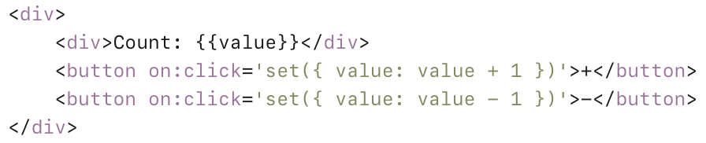
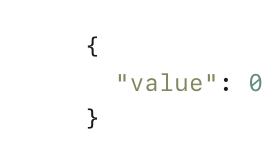

  
<h3 align="center"></h3>
<h3 align="center"></h3>
  

[Svelte](https://svelte.technology) is among [the fastest libraries](http://www.stefankrause.net/js-frameworks-benchmark5/webdriver-ts/table.html) to build user interfaces. Contrary to React, Vue, Inferno — Svelte has no runtime. Components are written using HTML, CSS and JavaScript (plus a few extra bits you can learn in under 5 minutes). During your build process Svelte compiles them into tiny, standalone/deduplicated JavaScript modules. With static analysis, Svelte makes sure that the browser does as little work as possible. Other than being fast and weightless, Svelte has [the lowest memory footprint after hand-written vanilla JavaScript](http://www.stefankrause.net/js-frameworks-benchmark5/webdriver-ts/table.html). Svelte can render on both client and server.
  
<h3 align="center"></h3>

<a href="https://svelte.technology/repl/?version=1.6.11&gist=c80ee9ec68fefa93617dfc40400851f5">Open in REPL</a> — <a href="https://twitter.com/sveltejs/status/835273714619002880">Context</a>

    

## Contents

- [Examples](#examples)
- [Starters](#starters)
- [Resources](#resources)
- [Articles](#articles)
- [Principles](#principles)
- [Utilities](#utilities)
- [Plugins](#plugins)
  - [Routing](#routing)
  - [Miscellaneous](#miscellaneous)
- [Benchmarks](#benchmarks)
- [Community](#community)

  

## Examples
- [Svelte REPL](https://svelte.technology/repl)
- [Home Assistant prototype](https://github.com/balloob/home-assistant-svelte-prototype)
- [TodoMVC](https://github.com/sveltejs/svelte-todomvc)
- [svelte-rollup-ssr-bundle-demo](https://github.com/Rich-Harris/svelte-ssr-bundle) - Server-side rendering demo
- [charpeni/svelte-example](https://github.com/charpeni/svelte-example)
- [EmilTholin/svelte-test](https://github.com/EmilTholin/svelte-test)
- [codenames-svelte](https://github.com/lukechinworth/codenames/tree/svelte) - Redux state example
- [svelte-with-ts](https://github.com/MiYogurt/svelte-with-ts)
- [svelte-state-renderer](https://github.com/TehShrike/svelte-state-renderer)
- [Andorbal/svelte-router-example](https://github.com/Andorbal/svelte-router-example)
- [oren/svelte-router-example](https://github.com/oren/svelte-router-example)
- [svelte-notepad](https://github.com/Garrett-/svelte-notepad)
- [svelte-markdown-editor](https://github.com/Garrett-/svelte-markdown-editor)
- [svelte-routing](https://github.com/Franksey/svelte-routing)
- [single-spa-example](https://github.com/CanopyTax/single-spa-examples/tree/master/src/svelte)

## Starters
- [svelte-typescript-webpack-starter](https://github.com/brakmic/Svelte-TypeScript-WebPack-Starter)

## Resources
- [Guide](https://svelte.technology/guide)
- [Blog](https://svelte.technology/blog)

## Articles
- [Frameworks without the framework: why didn't we think of this sooner?](https://svelte.technology/blog/frameworks-without-the-framework/) - by Rich Harris, Svelte creator
- [Interview with Rich Harris](https://survivejs.com/blog/svelte-interview/)

## Principles
- [De-duplication](https://github.com/sveltejs/svelte/pull/215) - [Allows](https://github.com/sveltejs/svelte/issues/9) [for](https://github.com/sveltejs/svelte/issues/203) [non-standalone](https://github.com/sveltejs/svelte/issues/67) [components](https://www.reddit.com/r/javascript/comments/5fcwhz/svelte_the_magical_disappearing_ui_framework/dajexmg/) to avoid duplication
- [_**Opt-in**_ Two-way Data Binding](https://github.com/sveltejs/svelte/issues/54)

## Utilities

- [svelte-cli](https://github.com/sveltejs/svelte-cli)
- [svelte-webpack-loader](https://github.com/sveltejs/svelte-loader)
- [svelte-rollup-plugin](https://github.com/rollup/rollup-plugin-svelte)
- [sveltify](https://github.com/tehshrike/sveltify) - Browserify transform
- [gulp-svelte](https://github.com/shinnn/gulp-svelte)
- [metalsmith-svelte](https://github.com/shinnn/metalsmith-svelte)
- [system-svelte](https://github.com/CanopyTax/system-svelte) - System.js plugin
- [meteor-svelte](https://github.com/meteor-svelte/meteor-svelte)

## Plugins
### Routing
- [abstract-state-router](https://github.com/TehShrike/abstract-state-router)
- [svelte-router](https://github.com/jikkai/svelte-router)

### Miscellaneous
- [single-spa-svelte](https://github.com/CanopyTax/single-spa-svelte)

## Benchmarks
- [js-frameworks-benchmark-5](http://www.stefankrause.net/js-frameworks-benchmark5/webdriver-ts/table.html)
- [svelte-dbmonster](https://github.com/sveltejs/svelte-dbmonster)

## Community
- [Gitter](https://gitter.im/sveltejs/svelte)
- [Twitter](https://twitter.com/sveltejs)
- [Stack Overflow](http://stackoverflow.com/questions/tagged/svelte)

    
<h3 align="right">License</h3>

